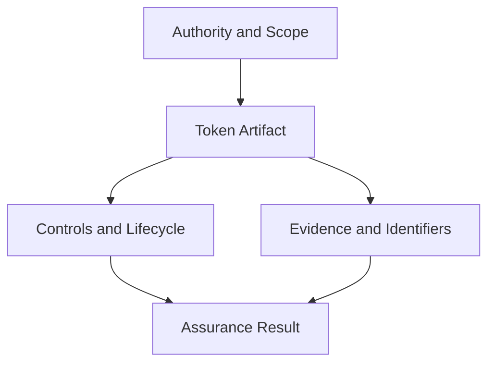

# Tokenization Landscape

This guide aligns the Token Taxonomy Framework with the current state of tokenized-asset practice. TTF remains implementation-neutral, but token programs now need to describe more than token type and behavior. They need to make authority, legal claim, transfer control, custody, lifecycle, identifiers, and evidence explicit enough for implementers, reviewers, and assurance teams to test.

## Current Design Pressure

| Domain pressure | Practical implication for TTF artifacts |
|---|---|
| Regulated real-world assets | A token definition should identify the legal asset or claim, issuer authority, custody model, eligible holder criteria, transfer restrictions, and redemption or enforcement path. |
| Tokenized money and settlement assets | Stable-value and deposit-like tokens should distinguish issuer type, backing asset, redemption right, settlement finality, reserve reporting, and applicable regulatory category. |
| Financial asset tokenization | Tokenized bonds, funds, collateral, and securities should separate the token record from the underlying legal instrument and lifecycle events. |
| Digital token identifiers | Where a token maps to a recognized identifier scheme, the artifact should record the identifier scheme, assignment authority, and registry reference. |
| Permissioned transfer controls | Transferability is no longer a simple behavior. Regulated implementations often require identity, eligibility, jurisdiction, sanctions, holding-period, and role checks before transfer. |
| Organizational identity | Issuers, custodians, verifiers, registries, smart-contract operators, and authorized representatives should be identifiable through durable organizational identifiers where available. |
| Evidence-rich sustainability assets | dMRV tokens should carry measurement boundaries, methodology references, verifier roles, source evidence, registry dependencies, revocation conditions, and double-counting controls. |
| Interoperable lifecycle automation | Issuance, transfer, redemption, suspension, revocation, corporate action, settlement, and reporting events should be modeled as auditable lifecycle transitions. |

## Token System View

TTF v1.3.0 treats a token artifact as a governed system description:

The token artifact remains the reusable design unit, but the v1.3.0 profile asks reviewers to identify who is authorized to define it, what legal or operational claim it represents, which controls are enforceable, what evidence is retained, and how downstream systems can verify its state.

## Recommended Tokenization Classes

| Class | TTF focus | Additional v1.3.0 metadata |
|---|---|---|
| Utility or access token | Token behavior and rights to access a service. | Issuer, service boundary, transferability, expiry, consumer disclosure, revocation. |
| Stable-value token | Fungible token with value reference and redemption logic. | Reserve model, issuer authorization, redemption claim, audit reports, jurisdiction. |
| Tokenized deposit or settlement asset | Bank or regulated institution liability used for settlement. | Issuer type, settlement finality, account linkage, regulatory perimeter, operational controls. |
| Tokenized security or bond | Token record representing a regulated financial instrument. | Legal instrument reference, investor eligibility, transfer restriction, corporate actions, custodian. |
| Permissioned RWA token | Asset-backed or claim-backed token with controlled holders. | Asset custody, asset verification, eligible holder credentials, jurisdictional transfer checks. |
| Collateral token | Asset representation used in margin or collateral workflows. | Valuation source, encumbrance state, substitution rights, liquidation process, audit trail. |
| dMRV or ecological claim token | Token tied to measured, reported, and verified evidence. | Methodology, project boundary, verifier, claim source, registry dependency, revocation conditions. |
| Verifiable document or title token | Token representing a document, title, license, bill of lading, or credential-like object. | Issuing authority, subject, holder binding, revocation registry, dispute process. |

## Design Questions

Every new or materially changed artifact should answer:

| Question | Why it matters |
|---|---|
| Who has authority to define, issue, amend, suspend, or withdraw this artifact? | Prevents implied endorsement and clarifies governance scope. |
| What does the token holder actually hold? | Separates a token record from legal title, economic exposure, service access, or evidence claim. |
| What prevents unauthorized transfer or use? | Makes eligibility and policy enforcement testable. |
| What can be revoked, paused, burned, redeemed, or superseded? | Clarifies lifecycle and failure handling. |
| What evidence survives after an action? | Supports auditability, conformance, and dispute resolution. |
| What external standards or registries are referenced? | Supports interoperability without treating TTF as a legal or regulatory framework. |

## Relationship to TTF Core

The original TTF dimensions remain useful for composition:

- base type;
- fungibility;
- divisibility;
- representation;
- supply;
- behaviors;
- property sets;
- token templates.

The v1.3.0 improvement is to add a governed context around that composition. For practical tokenization, the market question is not just "what kind of token is this?" It is "what authority, claim, control, lifecycle, and evidence does this token make executable?"
